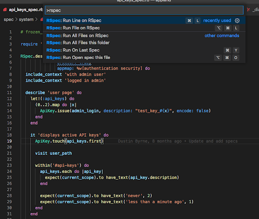
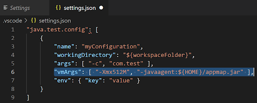
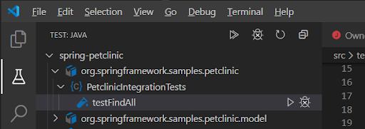

# AppLand for Visual Studio Code

AppLand is a self-contained Visual Code extension that automatically records and diagrams software behavior by executing test cases.  Now you can walk through automatically generated white-board style diagrams right in your IDE without any effort.  AppLand helps developers 

- Onboard to code architecture, with no extra work for the team 
- Conduct code and design reviews using live and accurate data
- Troubleshoot hard-to-understand bugs with visuals 

Each interactive diagram links directly to the source code, and the information is easy to share.

## Summary of features

- Component diagrams akin to the C4 model’s level 3 diagrams
- Execution trace diagrams akin to the C4 model’s level 4 diagrams
- List of Webservices generated automatically from test cases
- List of SQL queries generated automatically from test cases
- Search for class, package or route
- Code linkage of the diagram to the source code it relates to

# Getting Started

AppLand records behavior of running code as [AppMaps](https://github.com/applandinc/appmap) during test execution and visualizes them in interactive diagrams.

## TL&DR; version

Install through [VS Code extensions](https://marketplace.visualstudio.com/items?itemName=AppLandInc.appland)

To generate AppMap files, an AppMap client must be installed and configured for your project. If it's not already, you can find the language client for your project along with setup instructions on GitHub:

- [AppMap client for Ruby](https://github.com/applandinc/appmap-ruby)
- [AppMap client for Java](https://github.com/applandinc/appmap-java)

Open an `*.appmap.json` file in Visual Studio Code to view diagrams of the recording.

This extension adds the following commands:
- `AppLand: Open most recently modified AppMap file`

## Installation

Install the extension with the `Install` button in the Marketplace.

## Initial setup of the client

The client is required for recording AppMaps when running tests in VS Code.

### Ruby

Follow the `Installation and Configuration` sections in [github.com/applandinc/appmap-ruby](github.com/applandinc/appmap-ruby#installation).

### Java

Download the most recent `appmap.jar` from [https://github.com/applandinc/appmap-java/releases](https://github.com/applandinc/appmap-java/releases). 

Then follow the `Configuration chapter` in [github.com/applandinc/appmap-java](github.com/applandinc/appmap-java#configuration).

## Recording an AppMap

### Ruby

When the client is installed and configured for your application, add `APPMAP=true` to your test environment and run a test. The client will record a new AppMap file that you will view and interact with in the IDE. The Ruby client saves AppMap files with the `.appmap.json` extension in the project folder `tmp/appmap/[rspec|minitest|cucumber]`.

The following sections provide detailed instructions for recording AppMaps from RSpec, Minitest, and Cucumber test cases.

#### RSpec
 - Install the extension `vscode-run-rspec-file` from [the Marketplace](https://marketplace.visualstudio.com/items?itemName=Thadeu.vscode-run-rspec-file).
 - Open Workspace Settings
  

 - Prepend `env APPMAP=true` to the RSpec command

 - Now when you run an RSpec test, the AppMap JSON file will be generated.

Alternatively, you can generate AppMaps from tests manually from the command line. See instructions in [https://github.com/applandinc/appmap-ruby](https://github.com/applandinc/appmap-ruby#rspec)

#### Minitest

See instructions in [https://github.com/applandinc/appmap-ruby/blob/master/README.md](https://github.com/applandinc/appmap-ruby/blob/master/README.md#minitest)

#### Cucumber

See instructions in [https://github.com/applandinc/appmap-ruby/blob/master/README.md](https://github.com/applandinc/appmap-ruby/blob/master/README.md#cucumber)

### Java

The Java client is run as a Java agent and must be started along with the JVM. This is typically done by passing the `-javaagent` argument to your JVM, for example

`java -javaagent:$HOME/appmap.jar <java command arguments>`

#### Debug information for links to source files

AppMap diagrams feature links to original source code. In order for the links to work, please make sure to compile your source code with the debug information enabled.

#### Maven, Maven Surefire, and Gradle

The `appmap-java` project on GitHub has [instructions for running the `appmap.jar` Java agent within the Maven, Surefire, or Gradle](https://github.com/applandinc/appmap-java/blob/master/README.md#other-examples).

#### JUnit
You can use the `Java Test Runner` extension to record AppMaps from your JUnit tests.

- Install the Java Test Runner extension from [the Marketplace](https://marketplace.visualstudio.com/items?itemName=vscjava.vscode-java-test).

- Open the workspace settings json file and add the `-javaagent` parameter to the `vmArgs` section, replace `${HOME}` with your home directory or where you saved the file:
 `"vmArgs": [ "-Xmx512M", "-javaagent:${HOME}/appmap.jar" ],`
 See detailed instructions for the Java Test Runner configuration [here](https://github.com/Microsoft/vscode-java-test/wiki/Run-with-Configuration).

- Run your JUnit test and the AppMap JSON file will be generated.. You can start them from the Test Explorer:

## Opening an AppMap diagram
### Open most recently modified AppMap
Use AppLand extension command `AppLand: Open most recently modified AppMap` to open the AppMap file that has most recently changed. When you have run a single test, this will be the AppMap for that test.

### Opening an AppMap from the file tree navigator

Alternatively, open any generated AppMap file directly from the file tree navigator:
1. Locate an `.appmap.json` file in your project folder. 
    1. For Ruby apps, the files will be created in a  `tmp/appmap/[test_framework]` directory
    1. For Java apps, the files will be created in the workspace folder unless configured differently in the Java Test Runner settings
1. Open the file. A new AppLand viewer window will open. 

## Using the AppMap diagram
Depending on the test run and functionality covered, you should see a viewer with a diagram similar to this one:

### Details
The “Details” panel on the left hand side will be used when you click on something, such as a package or class. 

### Filters
“Filters” is used to type in the name of a particular object, such as a class, and focus the diagrams on that class. When you are brand new to the code base, you may not have any particular class names in mind, but as you use this tool in the future, perhaps to troubleshoot a bug, you may have a better idea of exactly what you want to look at, and Filters can help with that. 

### Components
This is a view of the code, grouped into classes and packages, that was actually executed by the test case. When a class calls another class, the result is a link (edge) connecting them, with an arrow denoting the call direction. Keep in mind, this data isn’t coming just from a static analysis of the dependencies in the code (e.g. import and require statements). It’s coming from the actual execution trace through the code base. 

SQL queries are denoted by the database icon. You can get specific details about SQL by switching to the Events view.
### Events
Click on a class in the Components view, then choose one of the functions, then choose an Event in which that function is used.

Clicking on the event will open the Events view. 

Each node (box) in the Events view represents a specific HTTP server request, function call, or SQL query which occurred in the test case. You can think of it like having the data from a debugger, but you can jump to any location in the call graph. The Events view flows from left to right and top to bottom as the program moves forward in time. 

### Interacting with the diagrams

The diagrams are fully interactive; they aren’t static pictures like UML. You can:
- Expand and collapse packages.
- Click on classes to view detailed information about that class.
- List the functions of a class which are used by the test case.
- Explore callers and callees.
- View variable names and values at any point in the code flow, clicking on a variable in the Events view
- View SQL queries.
- Open source code right to the line of any particular function, by clicking on “Source location”

## Sharing

### Record and share videos and screenshots

The easiest way to share the diagrams with a wider audience is via screencasts, recorded screen videos and screenshots. 
Here are some tips:
- Use the built-in [screencast mode](https://dzhavat.github.io/2019/09/18/screencast-mode-in-vs-code.html) that will help your audience better follow your mouse and keyboard actions
- There are many great tools for recording and sharing screen videos. To mention a few:
    - [Loom](https://www.loom.com/), a favorite tool in many teams
    - [ScreenToGif](https://www.screentogif.com), a simple yet powerful OSS screen recorder
    - The Marketplace [lists extensions for screen recording](https://marketplace.visualstudio.com/search?term=screen%20recorder&target=VSCode&category=All%20categories&sortBy=Relevance)

### Share AppMap files for viewing in VSCode

Generated AppMap files can be viewed by others with the AppLand extension. So, one option for sharing is to simply send the `appmap.json` file to your colleague.

### Share AppMap files in the SaaS [https://app.land](https://app.land) sandbox
[App.Land](https://app.land) is a free sandbox that can be rapidly used as an AppMap repository and as a collaboration and sharing tool for your team. 

1. [Sign-up](https://app.land) to app.land , create an account for your organization and invite others to join
1. [Follow these instructions](https://app.land/setup/cli) to install CLI tools and upload your AppMaps to the server
2. Open and share your AppMaps (called scenarios in the app.land UI) from the UI. You can make the shareable links private - accessible for members of your organization only, or public.

## Advanced configuration

### Refine your AppMaps for more impactful results

Recording large, complex applications can lead to acquisition of extraneous utility details that are not valuable for understanding how the application architecture works. If your AppMaps get too large, fine-tune the instrumentation to only record valuable classes and method calls in the `appmap.yml` configuration file:

1. [Download and install AppLand CLI tools](https://app.land/setup/cli#install-command-line-tools) (only follow step 1 in the instructions)
2. [Refine your AppMap configuration](https://github.com/applandinc/appland-cli/blob/master/doc/refine-appmaps.md)

Then re-run the tests to record new AppMap files with the updated configuration.

### Share customizations with your team

Simply share your `appmap.yml` configuration file with others. Use of a git repository is recommended for tracking and sharing updates among members of your team. 

### What if I don’t have test cases?

AppLand has other solutions which help you profile and automatically diagram software through dynamic analysis, without relying on test cases.  We have also hosted analytics solutions to analyze code architecture over entire codebases and across multiple releases.  To learn more about these solutions go to [AppLand.com](https://appland.com/) or [contact us](http://info@app.land).

# About AppLand

## Details about how AppLand technology works
Please see documentation posted on [appland.org](https://appland.org).

## Support 

### Contact us
Let us know by joining the discussion on [Discord](https://discord.com/invite/N9VUap6) or submit your issue on [GitHub](https://github.com/applandinc/vscode-appland). 

### Supported platforms

#### VS Code Requirements
 - AppLand for VS Code has been tested on macOS and Windows
 - Requires VS Code 1.50 and newer (#tbd)

#### Supported languages and frameworks
 - Ruby: MiniTest, RSpec and Cucumber test frameworks
 - Java: JUnit framework

