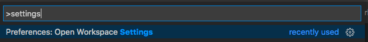

# Instructions for Ruby projects

## Installation

Install the extension with the `Install` button in the Marketplace.

## Initial setup of the client

The client is required for recording AppMaps when running tests in VS Code.

Follow the `Installation and Configuration` sections in [github.com/applandinc/appmap-ruby](github.com/applandinc/appmap-ruby#installation).

## Recording an AppMap

When the client is installed and configured for your application, add `APPMAP=true` to your test environment and run a test. The client will record a new AppMap file that you will view and interact with in the IDE. The Ruby client saves AppMap files with the `.appmap.json` extension in the project folder `tmp/appmap/[rspec|minitest|cucumber]`.

The following sections provide detailed instructions for recording AppMaps from RSpec, Minitest, and Cucumber test cases.

#### RSpec
 - Install the extension `vscode-run-rspec-file` from [the Marketplace](https://marketplace.visualstudio.com/items?itemName=Thadeu.vscode-run-rspec-file).
 - Open Workspace Settings
  

 - Prepend `env APPMAP=true` to the RSpec command

 - Now when you run an RSpec test, the AppMap JSON file will be generated.

Alternatively, you can generate AppMaps from tests manually from the command line. See instructions in [https://github.com/applandinc/appmap-ruby](https://github.com/applandinc/appmap-ruby#rspec)

#### Minitest

See instructions in [https://github.com/applandinc/appmap-ruby/blob/master/README.md](https://github.com/applandinc/appmap-ruby/blob/master/README.md#minitest)

#### Cucumber

See instructions in [https://github.com/applandinc/appmap-ruby/blob/master/README.md](https://github.com/applandinc/appmap-ruby/blob/master/README.md#cucumber)

## Opening an AppMap diagram

### Open most recently modified AppMap
Use AppLand extension command `AppLand: Open most recently modified AppMap` to open the AppMap file that has most recently changed. When you have run a single test, this will be the AppMap for that test.

## Location of AppMaps in the file tree navigator

For Ruby apps, the files will be created in a  `tmp/appmap/[test_framework]` directory

## Using the AppMap diagram

Please follow the instructions in [README.md](../README.md#using-the-appmap-diagram "README").